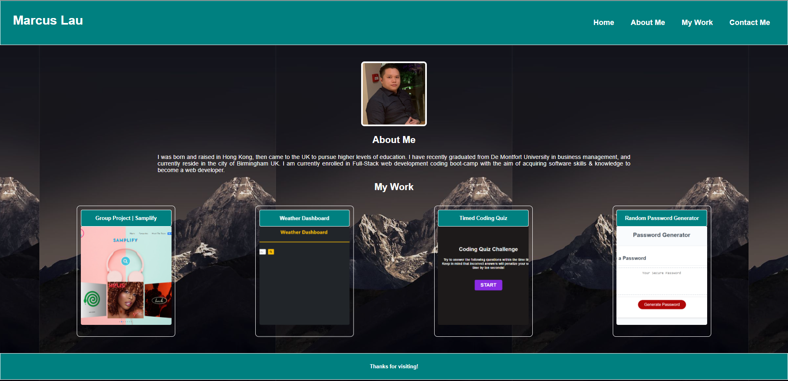

# Advanced-CSS-Portfolio

## Description
A personal portfolio using HTML and CSS. 

[link to deployed project page URL] https://marcuslau0903.github.io/week2Advanced-CSS-Portfolio/

[link to GitHub repository] https://github.com/marcuslau0903/week2Advanced-CSS-Portfolio 

- [x] The cards contains content that demonstrates previous work and by clicking on the images it will take you to deployed application.

- [x] Developer's name, recent photo, links to sections about me, my previous work and contact info. 

- [x] Responsive layout that adapts to desktop, tablet and mobile viewport.

## Extra Features

- [x] Use of pseudo class such as Hover, transition & transform to animate cards, creating a better user experiencs.
- [x] font awsome icons.
- [x] favicon. 

## Screen shots 

